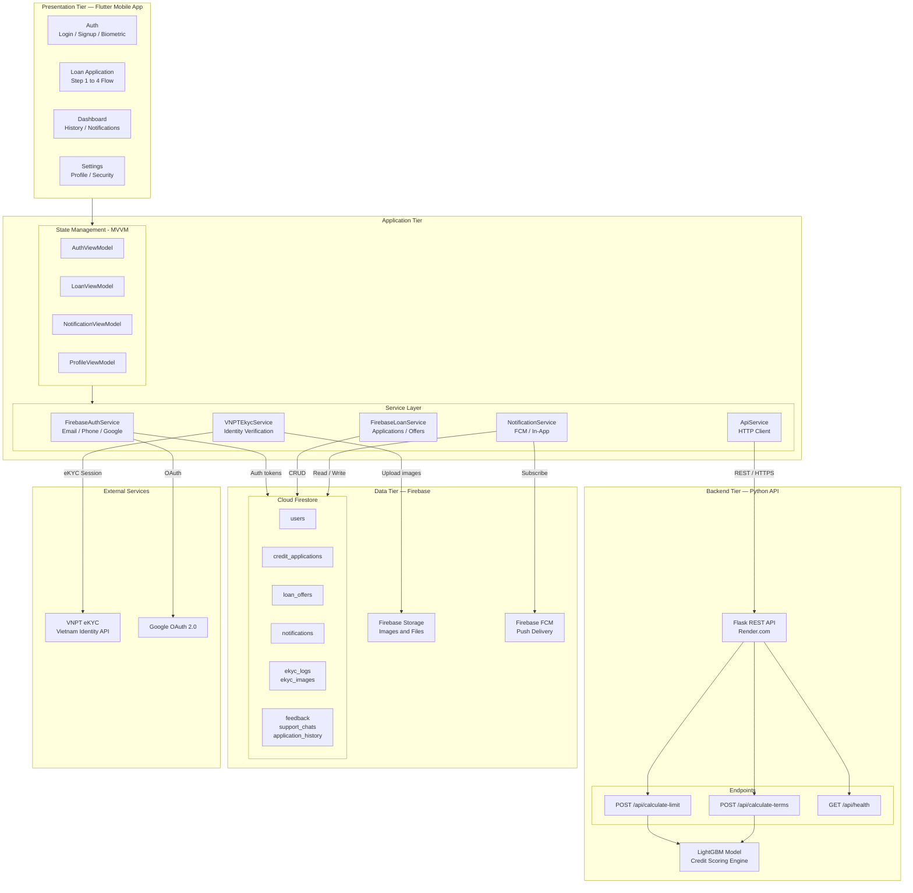
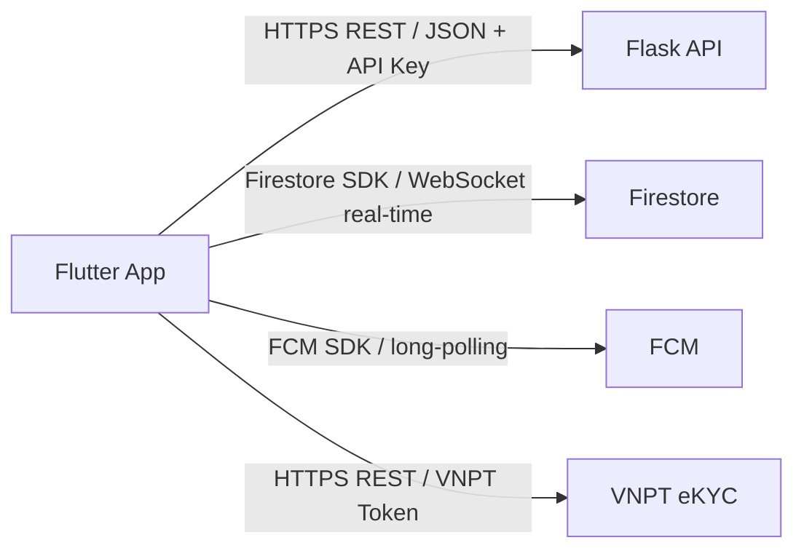

# System Architecture — Credit Scoring App

## Overview

The application follows a **4-tier architecture**: a Flutter mobile client, an application logic layer, a cloud-hosted backend API, and a Firebase data layer. Identity verification is handled via the VNPT eKYC third-party service.

---

## System Architecture Diagram

---

## Architecture Pattern

| Tier | Technology | Pattern |
|---|---|---|
| Presentation | Flutter (Dart) | MVVM with Provider |
| Application | Dart Service Classes | Dependency Injection |
| API Backend | Python + Flask | REST + Retry logic |
| ML Engine | LightGBM | Pickle-serialized model |
| Database | Cloud Firestore | NoSQL Document store |
| File Storage | Firebase Storage | Object storage |
| Auth | Firebase Auth | JWT + OAuth 2.0 |
| Messaging | Firebase FCM | Push notification broker |
| Identity | VNPT eKYC | Third-party REST API |

---

## Communication Protocols

