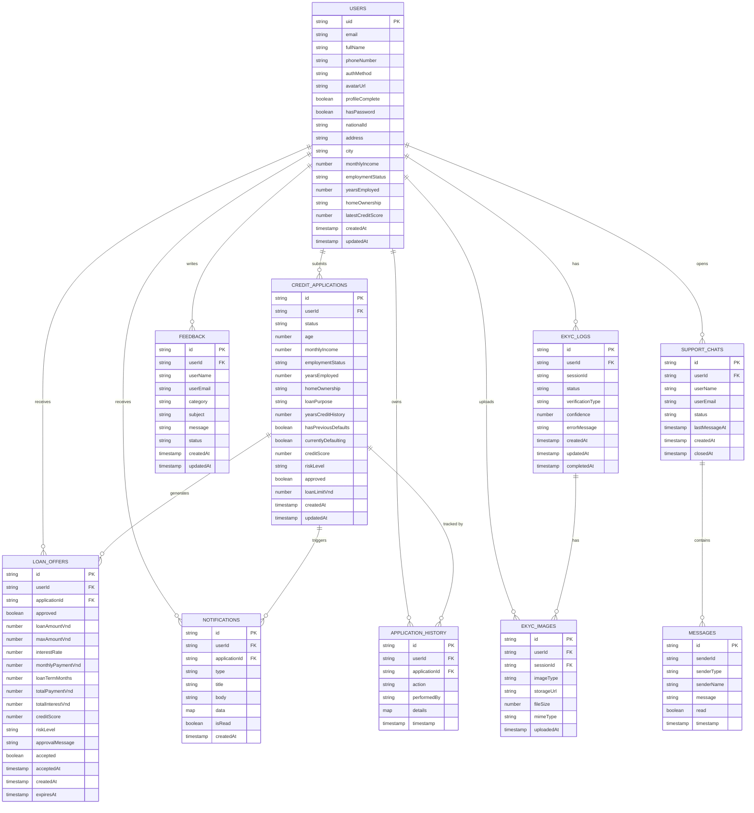

# Database Schema Diagram — Credit Scoring App

> **Database**: Cloud Firestore (NoSQL Document Store)
> **Total Collections**: 10 (+ 1 subcollection)

---

## Schema Diagram



---

## Field Type Reference

| Type | Description |
|---|---|
| `string` | Text value |
| `number` | Integer or float |
| `boolean` | true / false |
| `timestamp` | Firestore Timestamp (date + time) |
| `map` | Nested JSON object |
| `array` | List of values |
| `PK` | Primary Key — Firestore Document ID |
| `FK` | Foreign Key — Reference to another document |

---

## Collection Index Reference

| Collection | Indexed Fields |
|---|---|
| `credit_applications` | `userId` ASC + `createdAt` DESC |
| `loan_offers` | `userId` ASC + `createdAt` DESC |
| `notifications` | `userId` ASC + `isRead` ASC |
| `notifications` | `userId` ASC + `createdAt` DESC |

---

## Subcollection Structure

```
support_chats/{chatId}
    └── messages/{messageId}

users/{userId}
    └── settings/{document}
```
