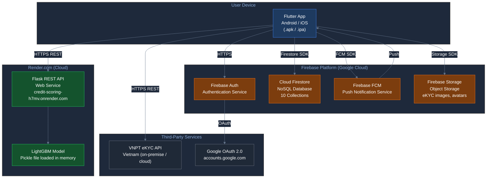

# Deployment Diagram — Credit Scoring App

---

## Where Each Component Is Hosted

---

## Hosting Summary

| Component | Platform | URL / Location |
|---|---|---|
| Flutter Mobile App | User Device | Android / iOS |
| Firebase Auth | Google Firebase | firebase.google.com |
| Cloud Firestore | Google Firebase | firebase.google.com |
| Firebase Storage | Google Firebase | firebase.google.com |
| Firebase FCM | Google Firebase | firebase.google.com |
| Flask REST API | Render.com | credit-scoring-h7mv.onrender.com |
| LightGBM Model | Render.com (in-memory) | Loaded at API startup |
| VNPT eKYC | VNPT Vietnam | Third-party API |
| Google OAuth 2.0 | Google | accounts.google.com |
