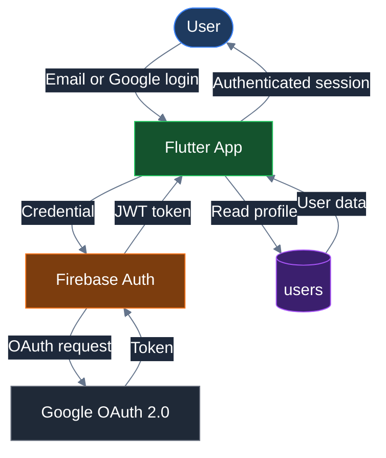
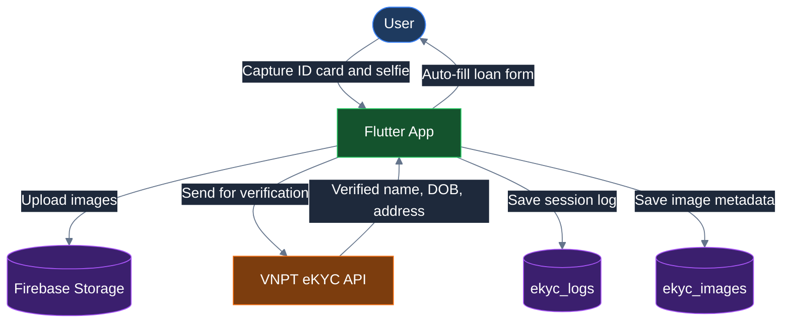
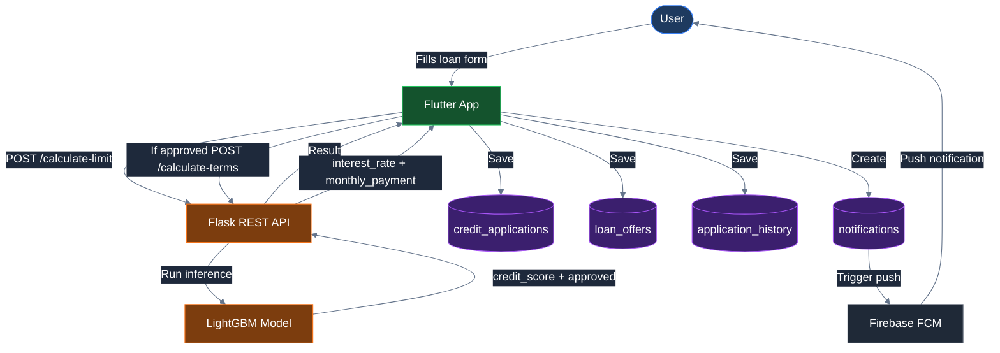

# Data Flow Diagrams — Credit Scoring App

---

## Flow 1 — Authentication

```mermaid
%%{init: {"theme": "base", "themeVariables": {"primaryColor": "#1e3a5f", "primaryTextColor": "#ffffff", "primaryBorderColor": "#3b82f6", "lineColor": "#64748b", "nodeBorder": "#475569", "clusterBkg": "#1e293b", "edgeLabelBackground": "#1e293b"}}}%%
flowchart TD
    classDef user     fill:#1e3a5f,stroke:#3b82f6,color:#fff
    classDef app      fill:#14532d,stroke:#22c55e,color:#fff
    classDef backend  fill:#7c3d0e,stroke:#f97316,color:#fff
    classDef store    fill:#3b1f6e,stroke:#a855f7,color:#fff
    classDef external fill:#1f2937,stroke:#6b7280,color:#fff

    U([User]):::user -->|Email or Google login| APP[Flutter App]:::app
    APP -->|Credential| FBA[Firebase Auth]:::backend
    FBA -->|OAuth request| GOG[Google OAuth 2.0]:::external
    GOG -->|Token| FBA
    FBA -->|JWT token| APP
    APP -->|Read profile| FS[(users)]:::store
    FS -->|User data| APP
    APP -->|Authenticated session| U
```

---

## Flow 2 — eKYC Identity Verification

```mermaid
%%{init: {"theme": "base", "themeVariables": {"primaryColor": "#1e3a5f", "primaryTextColor": "#ffffff", "primaryBorderColor": "#3b82f6", "lineColor": "#64748b", "nodeBorder": "#475569", "clusterBkg": "#1e293b", "edgeLabelBackground": "#1e293b"}}}%%
flowchart TD
    classDef user     fill:#1e3a5f,stroke:#3b82f6,color:#fff
    classDef app      fill:#14532d,stroke:#22c55e,color:#fff
    classDef external fill:#7c3d0e,stroke:#f97316,color:#fff
    classDef store    fill:#3b1f6e,stroke:#a855f7,color:#fff

    U([User]):::user -->|Capture ID card and selfie| APP[Flutter App]:::app
    APP -->|Upload images| STG[(Firebase Storage)]:::store
    APP -->|Send for verification| VNPT[VNPT eKYC API]:::external
    VNPT -->|Verified name, DOB, address| APP
    APP -->|Save session log| LOG[(ekyc_logs)]:::store
    APP -->|Save image metadata| IMG[(ekyc_images)]:::store
    APP -->|Auto-fill loan form| U
```

---

## Flow 3 — Loan Application

```mermaid
%%{init: {"theme": "base", "themeVariables": {"primaryColor": "#1e3a5f", "primaryTextColor": "#ffffff", "primaryBorderColor": "#3b82f6", "lineColor": "#64748b", "nodeBorder": "#475569", "clusterBkg": "#1e293b", "edgeLabelBackground": "#1e293b"}}}%%
flowchart TD
    classDef user     fill:#1e3a5f,stroke:#3b82f6,color:#fff
    classDef app      fill:#14532d,stroke:#22c55e,color:#fff
    classDef backend  fill:#7c3d0e,stroke:#f97316,color:#fff
    classDef store    fill:#3b1f6e,stroke:#a855f7,color:#fff
    classDef external fill:#1f2937,stroke:#6b7280,color:#fff

    U([User]):::user -->|Fills loan form| APP[Flutter App]:::app
    APP -->|POST /calculate-limit| API[Flask REST API]:::backend
    API -->|Run inference| ML[LightGBM Model]:::backend
    ML -->|credit_score + approved| API
    API -->|Result| APP

    APP -->|If approved POST /calculate-terms| API
    API -->|interest_rate + monthly_payment| APP

    APP -->|Save| CA[(credit_applications)]:::store
    APP -->|Save| LO[(loan_offers)]:::store
    APP -->|Save| AH[(application_history)]:::store
    APP -->|Create| NT[(notifications)]:::store
    NT -->|Trigger push| FCM[Firebase FCM]:::external
    FCM -->|Push notification| U
```
