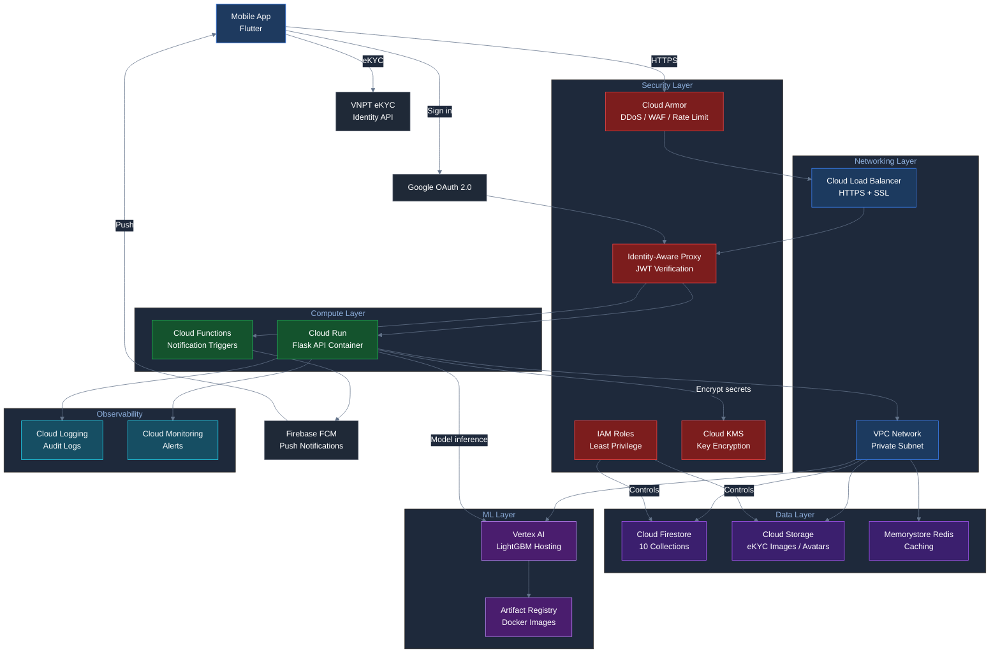
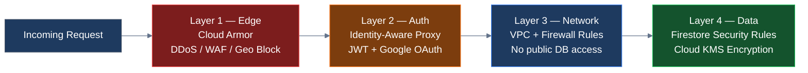

# Cloud Infrastructure Diagram — Credit Scoring App

> **Cloud Provider**: Google Cloud Platform (Firebase + GCP)

---

## GCP Services, Networking & Security

---

## Security Layers Breakdown

---

## GCP Services Summary

| Layer | Service | Purpose |
|---|---|---|
| Security | Cloud Armor | DDoS, WAF, rate limiting at the edge |
| Security | Identity-Aware Proxy | Verify JWT before API access |
| Security | IAM | Least-privilege roles per service |
| Security | Cloud KMS | Encrypt sensitive data fields |
| Network | Cloud Load Balancer | HTTPS termination, SSL |
| Network | VPC | Private subnet — DB not public |
| Compute | Cloud Run | Flask API, auto-scaling containers |
| Compute | Cloud Functions | Notification triggers |
| Data | Cloud Firestore | Main database, 10 collections |
| Data | Cloud Storage | eKYC images, user avatars |
| Data | Memorystore (Redis) | Cache frequent scoring results |
| ML | Vertex AI | LightGBM model hosting |
| ML | Artifact Registry | Docker image registry |
| Observability | Cloud Logging | API and Firestore audit logs |
| Observability | Cloud Monitoring | Uptime, latency, error alerts |
