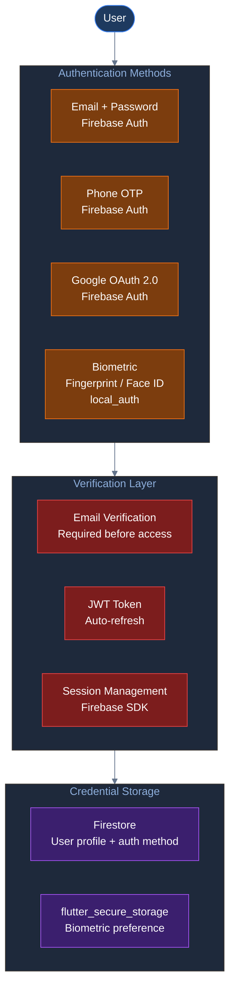
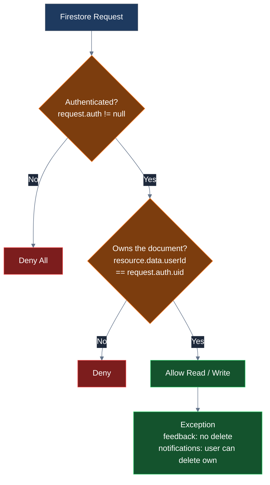

# Security Architecture — Credit Scoring App

---

## Authentication Flow

---

## Data Security Layers

```mermaid
%%{init: {"theme": "base", "themeVariables": {"primaryColor": "#1e3a5f", "primaryTextColor": "#ffffff", "primaryBorderColor": "#3b82f6", "lineColor": "#64748b", "nodeBorder": "#475569", "clusterBkg": "#1e293b", "edgeLabelBackground": "#1e293b"}}}%%
flowchart LR
    classDef l1 fill:#7c1d1d,stroke:#ef4444,color:#fff
    classDef l2 fill:#7c3d0e,stroke:#f97316,color:#fff
    classDef l3 fill:#14532d,stroke:#22c55e,color:#fff
    classDef l4 fill:#1e3a5f,stroke:#3b82f6,color:#fff
    classDef l5 fill:#3b1f6e,stroke:#a855f7,color:#fff

    R["Incoming Request"]

    L1["Layer 1\nCloud Armor\nDDoS / WAF / Rate Limiting"]:::l1
    L2["Layer 2\nIdentity-Aware Proxy\nJWT Verification\nGoogle OAuth Token"]:::l2
    L3["Layer 3\nHTTPS / TLS 1.3\nAll traffic encrypted in transit"]:::l3
    L4["Layer 4\nVPC Firewall Rules\nDatabase not publicly accessible"]:::l4
    L5["Layer 5\nFirestore Security Rules\nUser-scoped read/write only\nCloud KMS field encryption"]:::l5

    R --> L1 --> L2 --> L3 --> L4 --> L5
```

---

## Firestore Security Rules Summary

---

## Security Controls Summary

| Area | Control | Implementation |
|---|---|---|
| Authentication | Multi-method auth | Email, Phone OTP, Google OAuth |
| Authentication | Email verification | Required before app access |
| Authentication | Biometric | Fingerprint / Face ID via local_auth |
| Session | JWT tokens | Auto-refresh via Firebase SDK |
| Session | Secure storage | flutter_secure_storage (encrypted) |
| Transport | HTTPS / TLS | All API and Firebase calls |
| API | API key auth | Authorization header on scoring API |
| API | Rate limiting | Retry with backoff (3 attempts) |
| Database | Security rules | User can only access own documents |
| Database | No delete on feedback | Prevent tampering with submissions |
| Cloud | Cloud Armor | Edge DDoS, WAF protection |
| Cloud | IAP | JWT verification before compute |
| Cloud | VPC | Database has no public IP |
| Cloud | Cloud KMS | Encryption key management |
| Cloud | IAM | Least-privilege service accounts |
